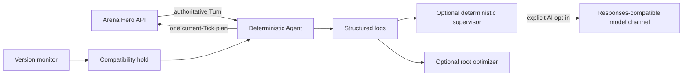

# Arena Hero Unattended Agent

[English](README.md) | [简体中文](README.zh-CN.md)

A deterministic, resource-first long-running agent for [Arena Hero](https://doc.arenahero.io/). It uses the official `arena-hero` Python SDK, keeps decisions inside the 15-second Tick window, and can run locally, in Docker, or as hardened systemd services.

This is a community project and is not an official Arena Hero product.

## Highlights

- Builds toward `12 Workers + 3 Vanguards + 4 Rangers = 19` population, staying below the 20-population resource penalty.
- Moves the Core away from the Beacon, prioritizes collection and survival, and maintains distributed Core defense.
- Scouts stale map regions, tracks resource memory, returns cargo, and recovers dropped cargo after losses.
- Avoids active enemy fleets while opportunistically clearing confirmed stationary threats or isolated Cores.
- Detects game/SDK compatibility changes before unattended play continues.
- Keeps AI out of the per-Tick control loop. Optional model review only analyzes anomaly reports after the fact.



## Requirements

- Python 3.11 or newer
- An Arena Hero API key
- Docker Compose v2 for the container path
- A systemd-based Linux server for the unattended server path

The tested contract is API `v0.1`, gameplay `v0.13`, and official Python SDK `0.2.8`. The bundled version monitor fails closed when it detects an incompatible contract.

## Quick Start

### Windows

```powershell
.\scripts\bootstrap.ps1
.\start_agent.ps1
```

The first start securely prompts for the Arena Hero key and appends it to the ignored `.env` file. After bootstrapping, `start_agent.cmd` is also available for double-click use and keeps errors visible instead of closing immediately.

### Linux or macOS

```bash
sh scripts/bootstrap.sh
cp .env.example .env
chmod 600 .env
# Edit .env and set ARENA_HERO_API_KEY.
sh scripts/run-agent.sh
```

### Docker Compose

```bash
mkdir -p secrets
cp secrets/arena_hero_api_key.example.txt secrets/arena_hero_api_key.txt
# Replace the placeholder in secrets/arena_hero_api_key.txt, then:
docker compose up -d --build
docker compose logs -f agent
```

Compose mounts the key as a Docker secret. The image runs as an unprivileged user with a read-only filesystem and does not include the supervisor or optimizer.

Use the published image without a local build:

```bash
ARENA_HERO_AGENT_IMAGE=ghcr.io/drew-z/arena-hero-agent:0.1.0 docker compose up -d --no-build
```

### Linux server with systemd

From a checked-out release on the server:

```bash
sudo sh scripts/install-systemd.sh
sudo journalctl -fu arena-hero-agent.service -o short-iso-precise
```

The installer prompts for the Arena Hero key without echoing it, installs into `/opt/arena-hero-agent`, and enables the main Agent plus the six-hour compatibility monitor.

Optional components are explicit:

```bash
# Deterministic, read-only anomaly reports; no model required.
sudo sh scripts/install-systemd.sh --with-supervisor

# Model review; first configure a private env file from the example.
sudo sh scripts/install-systemd.sh --with-ai /secure/path/supervisor.env

# High-privilege runtime tuning; read docs/deployment.md before enabling.
sudo sh scripts/install-systemd.sh --with-optimizer
```

## AI Monitoring Is Optional

The main Agent never needs a model. The supervisor always runs deterministic checks first. It calls a model only when all of these are true:

1. `ARENA_SUPERVISOR_AI_ENABLED=true` is explicitly set.
2. A deterministic anomaly trigger fires.
3. The base URL, API key, and at least one model ID are configured.

Model output is advisory and read-only. It cannot submit game plans, rewrite the tactic, or restart the Agent. See [configuration](docs/configuration.md) for provider settings.

The separate optimizer can update a narrow runtime configuration and restart the systemd service. It runs as root by design and is disabled by default.

## Configuration

Common Agent options:

```text
--worker-target 12
--beacon-policy retreat
--base-url https://api.arenahero.io
--compatibility-marker PATH
--no-compatibility-marker
```

See [configuration](docs/configuration.md), [deployment](docs/deployment.md), and [strategy](docs/strategy.md) for the complete operational contract.

Before the first public commit, follow the [release checklist](docs/release-checklist.md).

## Development

```bash
python -m pip install -e .
python -m unittest discover -v
python -m compileall -q arena_farmer.py arena_supervisor.py arena_optimizer.py arena_version_monitor.py
python scripts/check_secrets.py
```

Tests use synthetic UUIDs and do not need an API key or a live game connection. CI runs on Windows and Linux and also validates the container build.

## Security

Never commit `.env`, model-provider files, Docker secret files, logs, or systemd credentials. If a key appears in chat, logs, an issue, or Git history, rotate it immediately; deleting the text is not sufficient.

Report vulnerabilities through the process in [SECURITY.md](SECURITY.md). For contribution rules, see [CONTRIBUTING.md](CONTRIBUTING.md).

## License

Licensed under the [Apache License 2.0](LICENSE), matching the official Arena Hero Python SDK.
